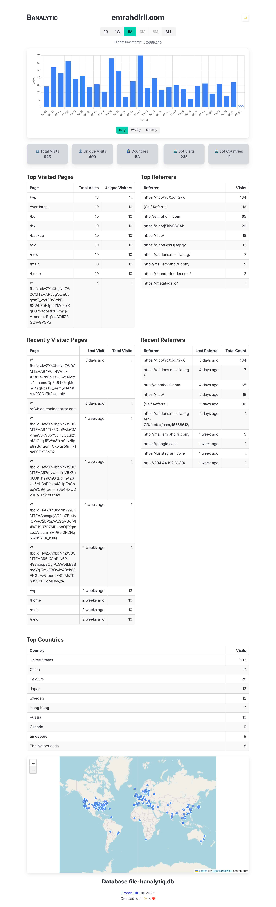

The simplest, most banal server-side alternative to Google Analytics

# Screenshot


# How to use
## Add it to your git project as a submodule:
```
$ git submodule add https://github.com/ediril/banalytiq.git
```

## Create a blank database
```
$ cd banalytiq
$ php -r "require 'banalytiq.php'; create_db();"
```

## Include banalytiq.php in your application's `index.php`
```php
<?php
    require_once __DIR__ . '/banalytiq/banalytiq.php';
    record_visit();
?>
```

## Push `/banalytiq` folder and the modified `index.php` to your webserver
TODO: We'll eventually have a way to do this via terminal.

NOTE: You do NOT need to deploy `vendor/` folder, that's only needed for development so the editor
can find the needed function definitions.

## Download the database file and fill in city, country, longitude, latitude for the collected IP addresses 
```
$ cd banalytiq
$ php download.php
$ php geo.php
```

Note: `download` script only works with FTP over TLS. It requires PHP to be compiled with OpenSSL support, and it only works with explicit FTPS.

## Visualize your web traffic
```
$ php -S localhost:8000
```

# How to apply updates to the submodule
```
$ git submodule update --remote
```

# How to prepare geolite database
Download and extract GeoLite2-City-CSV_{YYYYMMDD}.zip from [MaxMind](https://dev.maxmind.com)
```
> sqlite3 geolite2.db
.mode csv
.import GeoLite2-City-Blocks-IPv4.csv blocks
.import GeoLite2-City-Locations-en.csv locations
```
